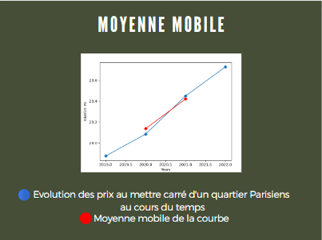
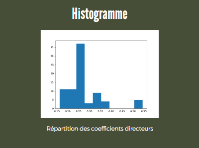

# Data731_project
    
## Etude de l'immobilier Parisien, *Boughanmi Rami, Simonet Théo*

## Introduction 

>L'immobilier est un domaine très intéressant. Beaucoup de personnes cherchent à y investir, agences immobilières biens sûrs, mais aussi banques, particuliers, ou même entreprises. Pouvoir prédire l'évolution de ce dernier est donc une tache utile, pour savoir à quel endroit investir, et à quel moment. Il est donc pertinent de faire des études stochastiques pour prédire l'évolution du prix de l'immobilier.

## Le projet 

>Nous nous sommes donc lancés dans le projet de prédire l'évolution du prix de l'immobiler. Étant donné que celui-ci est un domaine gigantesque, à l'échelle planétaire, il fallait donc se restreindre à une zone géographique particulière. Étant tous les deux Français nous nous sommes dit qu'il était légitime de faire cette étude sur une ville française et avons donc choisi la capitale, Paris.
>
>Après avoir trouvé un dataset qui comprenait le prix de milliers de biens immobilier suivant différents quartiers au fil du temps, nous nous sommes demandé comment nous pourrions faires des études stochastiques sur ces données.
>
>On a donc décidé dans un premier temps, après avoir récupéré les données depuis les fichiers jsons, et les avoir mis en forme pour pouvoir les exploiter correctement, de faire la moyenne mobile de l'évolution du prix aux mètres carrés des biens pour chaque quartier. 
On fait la moyenne des prix de tous les biens d'un quartier sur chaque année, on trace cette courbe puis on fait la moyenne mobile.

>Cette moyenne mobile nous donne donc une tendance d'évolution du prix de l'immobilier pour chaque quartier. On récupère donc ensuite les coéficiants directeurs des moyennes mobiles pour tous les quartiers, et on construit un histogramme avec ceci.

>Celui-ci nous indique plusieurs choses intéressantes, on peut remarquer deux parties. Une partie plutôt classique qui semble suivre une loi de distribution normale centrée sur une évolution de 0,25 par année. Résultat de l'inflation. 
Puis une seconde partie à part avec peu de quartiers mais qui ont une évolution bien plus importante chaque année. Ces quartiers la sont donc les quartiers dans Lequels il serait intéressant d'investir.
>
>Nous avons enfin essayé d'appliquer un modele autorégressif sur nos données pour essayer de prévoir l'évolution des prix au cours du temps mais le dataset que nous avions choisi comportait trop peu de données temporelles, et la modélisation n'était donc pas pertinante. 
Mais il serait donc intéressant de recommencer cette modélisation dans quelques années une fois que le dataset serait un peu plus complet.
>
>Finalement, nous avons essayé de mettre en forme les informations récoltées dans une map interactive, a l'aide d'une API. On peut donc voir sur la map mise en évidence les 5 quartiers sur lesquels il serait rentable d'investir suivant notre étude 
Vous pourrez retrouver la map [ici](https://opendata.paris.fr/explore/dataset/logement-encadrement-des-loyers/map/?disjunctive.annee&disjunctive.id_zone&disjunctive.nom_quartier&disjunctive.piece&disjunctive.epoque&disjunctive.meuble_txt&exclude.id_quartier=8&exclude.id_quartier=75&exclude.id_quartier=57&exclude.id_quartier=58&exclude.id_quartier=12&exclude.id_quartier=55&exclude.id_quartier=76&exclude.id_quartier=40&exclude.id_quartier=71&exclude.id_quartier=78&exclude.id_quartier=72&exclude.id_quartier=45&exclude.id_quartier=47&exclude.id_quartier=46&exclude.id_quartier=51&exclude.id_quartier=39&exclude.id_quartier=38&exclude.id_quartier=64&exclude.id_quartier=32&exclude.id_quartier=67&exclude.id_quartier=36&exclude.id_quartier=41&exclude.id_quartier=73&exclude.id_quartier=70&exclude.id_quartier=4&exclude.id_quartier=2&exclude.id_quartier=77&exclude.id_quartier=37&exclude.id_quartier=66&exclude.id_quartier=33&exclude.id_quartier=65&exclude.id_quartier=44&exclude.id_quartier=7&exclude.id_quartier=6&exclude.id_quartier=60&exclude.id_quartier=53&exclude.id_quartier=49&exclude.id_quartier=59&exclude.id_quartier=19&exclude.id_quartier=21&exclude.id_quartier=20&exclude.id_quartier=56&exclude.id_quartier=48&exclude.id_quartier=30&exclude.id_quartier=74&exclude.id_quartier=43&exclude.id_quartier=42&exclude.id_quartier=31&exclude.id_quartier=61&exclude.id_quartier=15&exclude.id_quartier=1&exclude.id_quartier=54&exclude.id_quartier=10&exclude.id_quartier=5&exclude.id_quartier=69&exclude.id_quartier=63&exclude.id_quartier=18&exclude.id_quartier=35&exclude.id_quartier=80&exclude.id_quartier=34&exclude.id_quartier=68&exclude.id_quartier=29&exclude.id_quartier=22&exclude.id_quartier=9&exclude.id_quartier=62&exclude.id_quartier=11&exclude.id_quartier=16&exclude.id_quartier=50&exclude.id_quartier=24&exclude.id_quartier=79&exclude.id_quartier=13&exclude.id_quartier=14&exclude.id_quartier=52&exclude.id_quartier=17&exclude.id_quartier=3&sort=nom_quartier&location=13,48.86155,2.30601&basemap=jawg.streets "titre de lien optionnel").

## Conclusion

>Uniquement avec notre petite analyse stochastique sommaire, nous avons reussi à trouver sur quel quartier Parisiens il serait intéressant d'investir. Il pourrait maintenant être intéressant dans un futur plus ou moins proche et avec plus de données de continuer cette étude pour pouvoir prédire quels quartiers auront une perspective d'évolution plus prespere et pourquoi ne pas élargir cette étude pour toucher d'autres villes ou d'autres pays et savoir ou placer son argent dans l'immobilier.

